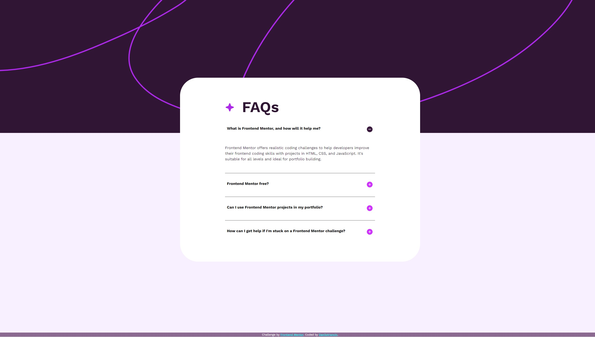

# Frontend Mentor - FAQ accordion solution

This is a solution to the [FAQ accordion challenge on Frontend Mentor](https://www.frontendmentor.io/challenges/faq-accordion-wyfFdeBwBz). Frontend Mentor challenges help you improve your coding skills by building realistic projects. 

## Table of contents

- [Overview](#overview)
  - [The challenge](#the-challenge)
  - [Screenshot](#screenshot)
  - [Links](#links)
- [My process](#my-process)
  - [Built with](#built-with)
  - [What I learned](#what-i-learned)
  - [Continued development](#continued-development)
  - [Useful resources](#useful-resources)
- [Author](#author)
- [Acknowledgments](#acknowledgments)


## Overview

### The challenge

Users should be able to:

- Hide/Show the answer to a question when the question is clicked
- Navigate the questions and hide/show answers using keyboard navigation alone
- View the optimal layout for the interface depending on their device's screen size
- See hover and focus states for all interactive elements on the page

### Screenshot




## My process

First I have setup in Visual Code all necessary files and prepared the workspace. Helpful quick shortcuts and macros in Visual Code helped me setup my script and stylesheet quickly.
Of course, can't forget to prepare that useful ChatGPT, just for the animations and for easier debugging once I am stuck with some regular procedural issues.
Initialized my project on GitHub and at the same time while I was learning theoretical knowledge from W3, and other sources, wrote the code.

### Built with

- Semantic HTML5 markup
- CSS custom properties
- Flexbox
- JavaScript
- Live Update Server


### What I learned

As this is my first project to make a professional looking component, I have learned a great deal about scheduling workflow and composing the website, taking into mind usecases and various helping hints. Such as adding a temporary .show class to the answer div's to help with the JavaScript and CSS transition animations. I have learned how to use .ttf files, and customize the fonts to my liking. Working with .svg files and their use-cases.
Load order and ensuring that the whole HTML file is loaded in order to properly use JavaScript manipulations on it. Using the DOM listener to ensure it. Very useful.
Learned about the SetTimeout method and transitions. Transitions, since it was my first time writing them and I kind of scrambled with them, I used the help of ChatGPT to give me a rough overview of how to make
the transition happen. the effect it gave me wasn't what I envisioned, so I used it's solution as a template and added my own functionalities and edited the solution to my liking.


To see how you can add code snippets, see below:

```js
        if (!currentDisplayOfAnswer) {
            // Fading in the answer text
            articleAnswer.style.display = 'inline-block';
            
            setTimeout(() => {
                articleAnswer.classList.add('show'); // Add the 'show' class to trigger the transition
            }, 100); // Adjust the duration as needed
            

            // Rotating the icon
            articleIcon.style.transform = 'rotateY(-360deg)'; // Change rotation to counterclockwise
            articleIcon.src = iconMinus;
        } else {
            // Fading out the answer text
            articleAnswer.classList.remove('show'); // Remove the 'show' class to trigger the transition
            setTimeout(() => {
                articleAnswer.style.display = 'none';
            }, 50); // Adjust the duration as needed

            // Rotating the icon
            articleIcon.style.transform = 'rotateY(0deg)'; // Reset rotation
            articleIcon.src = iconPlus;
```

### Continued development

I need to do a more complex challenge in order to nail down exactly what it is that I struggle with. I guess now I want to focus more on abstraction and why would I use one solution over the other. I want to know what it is that makes a solution as good as it gets.

### Useful resources

- [Example resource 1](https://www.w3schools.com/) - This helped me for theoretical and build logic. I really liked this pattern and will use it going forward.


**Note: Delete this note and replace the list above with resources that helped you during the challenge. These could come in handy for anyone viewing your solution or for yourself when you look back on this project in the future.**

## Author

- Website - [Danilo Vrancic](https://github.com/DaniloVrancic)
- Frontend Mentor - [@DaniloVrancic](https://www.frontendmentor.io/profile/DaniloVrancic)


## Acknowledgments

Big shoutout to [Kevin Powell](https://www.youtube.com/@KevinPowell) YouTube channel for some amazing CSS tutorials and debates.
